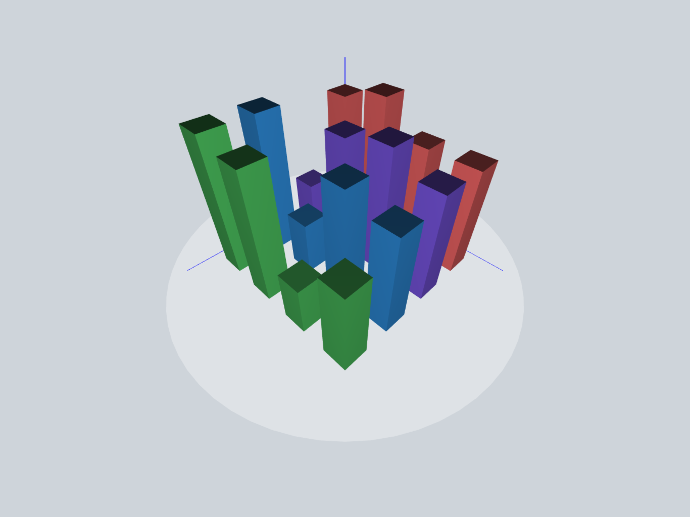

# 3D Data Visualization Demonstration &middot; [](./LICENSE) [](https://github.com/nattwasm/visualization-learn/pulls)



[⚡ Demo](https://threejs-data-visualization.s3.amazonaws.com/index.html)

Learning threejs for professor assistant at San Jose State University.
Viewers can click and drag to rotate the 3D bar graph.

## Getting Started

### Installing the project

```
npm install
```

### Running the project

```
npm run serve
```

### Building the project

```
npm run build
```

## License
All parts of this project are free to use and abuse under the open-source [MIT license](./LICENSE).

## Acknowledgement
Created by [Nhat Nguyen](https://github.com/nattwasm)
